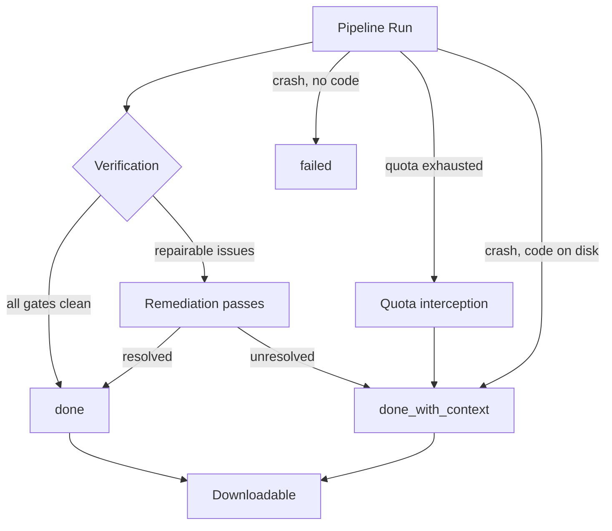

# Phase 21 Handoff — Resilient Refinement & Quota Context

## Status Report | Last Updated: August 16, 2026

---

## 1. Executive Summary

Builds no longer throw away working code. Low scores now trigger repair passes, quota
exhaustion produces a handoff document instead of a crash, and degraded builds stay
downloadable.

**All changes are in the working tree and uncommitted.**

| Metric | Result |
|--------|--------|
| Phase 21 suite (`test_phase21.py`) | ✅ **77/77** — new, offline, no LLM required |
| Phase 17 regression (`test_phase17.py`) | ✅ **54/54** — intact |
| Frontend build (`tsc -b`) | ✅ clean, exit 0 |
| `agents/debugger.py` | ⚠️ **982 lines** — recovered from a 414-line truncation |
| Committed | ⚠️ **0** — everything staged in the working tree |

---

## 2. What Was Broken

Two structural defects blocked the Phase 21 objectives.

### 2.1 Destructive Aborts

`_assert_deployable()` raised `PipelineVerificationError` immediately after the tester step.
Any failed import, any frontend TypeScript failure, or any test short of a perfect pass
aborted the run **before the documenter step ever executed** — no README, no SETUP.md,
status `failed`, and the download route refused the ZIP. Hours of generated code became
unreachable.

### 2.2 Quota Death Was an Untyped Crash

When Groq keys hit their daily cap, `_call_groq` raised `GroqDailyQuotaError` — but
`generate_text()` caught it and re-raised a plain `RuntimeError(...) from None`. The type
was destroyed at the boundary, so nothing downstream could distinguish *"quota is dead,
hand off"* from *"this file failed, retry it."* The retry loop then burned the remaining
step budget re-attempting work that could never succeed.

---

## 3. Build Status Vocabulary

The core of the change is a fourth terminal state. A degraded build is now a first-class
outcome that ships code, rather than a failure that discards it.



| Status | Meaning | Downloadable | Terminal |
|--------|---------|:------------:|:--------:|
| `queued` / `running` | In flight | — | — |
| `done` | Every verification gate clean | ✅ | ✅ |
| `done_with_context` | Usable code, degraded or quota-paused; ships `SESSION_CONTEXT.md` | ✅ | ✅ |
| `failed` | Crashed before producing usable code | ❌ | ✅ |
| `cancelled` | Stopped by the user | ❌ | ✅ |

`DOWNLOADABLE_STATUSES` and `TERMINAL_STATUSES` in `api_platform/runner.py` are the single
source of truth — downloads, jobs, websockets and analytics all import from there rather
than hard-coding `"done"`.

---

## 4. What Was Built

| Area | Change |
|------|--------|
| `llm_client.py` | Quota exception type preserved through `generate_text()`. `GroqDailyQuotaError` carries model, key counts and reset hint. Added `is_quota_exhausted()` and `get_quota_snapshot()`. A quota-dead heavy model now retries on the fast model instead of ending the build. |
| `agents/pipeline.py` | Hard gate replaced by `_diagnose()` + `_refine_and_remediate()`, which never raises. Per-step quota interception feeding `_finalise_with_context()`. A late-step crash with code already on disk is packaged, not discarded. |
| `agents/documenter.py` | `generate_session_context()` writes `SESSION_CONTEXT.md` (plus a `BUILD_CONTEXT.md` alias) with **zero LLM calls** on its primary path — essential, since its main trigger is quota exhaustion. |
| `api_platform/` | Four-way status branch in `runner.py`; download guard accepts `done_with_context`; analytics counts it as success; jobs and websockets treat it as terminal. Two migrated DB columns: `completion_reason`, `progress_percent`. |
| `frontend/src/` | Amber *Done (with context)* badge, a *Partial* dashboard filter, download button and explainer banner on degraded builds, terminal-status detection so the progress page stops polling. |
| `test_phase21.py` | New offline suite — 77 checks across 10 groups. Runs with no server and no LLM; every quota boundary is stubbed. |

> [!NOTE]
> The tree was already dirty at session start. `architect.py`, `backend_developer.py`,
> `tester.py`, `main.py`, `start_server.py`, `test_phase17.py` and `tools/*` carry
> pre-existing uncommitted work that was not touched by this phase.

---

## 5. What the todo_app Build Revealed

Build `fb3e4b24` ran 941.7s and spent 90,232 tokens. Its own records show **8/8 keys
available at completion** — it was not stopped by quota. It finished `done_with_context`
because repair could not resolve real test failures.

| Reported | Value | Reality |
|----------|-------|---------|
| Debug score | 3/3 | Files parse and import — says nothing about whether the app works |
| Review score | 7.5 | Graded generated code that is largely unimplemented |
| Test score | 1/9 | Even the one pass is not testing real behaviour |

**The shipped app does not run.** Four defect classes, none visible to the existing gates:

1. **Every route handler is a stub** — `routes.py` returns `[]` behind a TODO comment; the
   `Database` instance created in `main.py` is never passed to the routes.
2. **A phantom import** — `from weather import get_weather` sits inside a handler body, so
   it never runs at import time and 500s on the first request.
3. **Placeholder files never filled** — `schema.sql` and `requirements.txt` still carry the
   architect's scaffold text.
4. **Dangling frontend imports** — `App.js` imports `./TodoList` and `./TodoForm`, neither
   generated. Plain-JS projects receive no `tsc` validation at all.

> [!IMPORTANT]
> **On the quota concern.** That build was not stopped by quota, but it was expensive for a
> fixable reason: remediation re-ran the tester over *every* backend file on *every* pass,
> at up to three LLM retries per file, twice — roughly 9.5 of its 15.7 minutes, fixing
> nothing, because the failures were structural rather than something retries could
> resolve. This is now scoped (§6.2).

---

## 6. Follow-Up Fixes

### 6.1 Quota Errors Are No Longer Swallowed

Four call sites wrapped LLM calls in a bare `except Exception`. Because
`GroqDailyQuotaError` subclasses `RuntimeError`, quota death was being downgraded to a
per-file failure — the agent then marched through the remaining files producing empty
results, and the build reported a completion reason unrelated to quota.

Fixed in `reviewer.py`, `frontend_debugger.py`, and both `documenter.py` sites. Ordinary
per-file errors are still absorbed exactly as before.

### 6.2 Remediation Cost Controls

Re-testing is now scoped to files a pass actually repaired, merged into the existing results
so the aggregate score still covers the whole project. If the debugger repairs nothing, the
tester is not invoked at all and the loop stops early instead of repeating identical work.

### 6.3 Deterministic Output Audit

The import check runs `python <file>`, which only executes module-level code. A new zero-LLM
audit catches what that structurally cannot. Run against the shipped todo_app build, it
flags all four defect classes above:

```
* 2 planned file(s) still contain the scaffold placeholder: backend/schema.sql, requirements.txt
* 1 import references a module that does not exist locally and is not installed:
  `weather` (in backend/routes.py) — function-body imports fail only at request time
* 2 frontend imports point at files never generated: ./TodoForm, ./TodoList (App.js)
* 3 functions are unimplemented TODO stubs: get_daily_tasks(), get_habits(), get_todo_items()
```

These are **advisory**: they mark the build degraded and appear in `SESSION_CONTEXT.md`, but
deliberately do not trigger repair passes, because re-running the debugger cannot fix them.
A build with only advisory findings spends **zero tokens** on remediation.

---

## 7. The debugger.py Incident

Unrelated to the Phase 21 work, and worth knowing about.

`agents/debugger.py` shrank from 959 to 414 lines at 00:34, seven minutes after the todo_app
build finished. It was not edited as part of this work. It lost eleven methods present in
both the committed version and the version live earlier in the session — including
`_apply_structural_import_repairs`, which Phase 21's free deterministic repair pass calls.

The original source is not in git and was not recoverable from VS Code local history (its
only entry is a byte-copy of the replacement). It was rebuilt to 982 lines from three
sources, labelled per-section in the file header:

| Provenance | Extent | Confidence |
|------------|--------|------------|
| `[GIT]` | 771 lines from `git show HEAD` | ✅ Verbatim original |
| `[VERBATIM]` | `_accept_generated_fix()` plus 4 call-site lines | ✅ Read before loss |
| `[REBUILT]` | 4 methods, ~170 lines | ⚠️ Needs review |

The `[REBUILT]` methods were reconstructed from string constants in
`debugger.cpython-312.pyc` — docstrings, regexes, log messages and local variable names are
exact; the control flow around them is inferred. They pass a functional test on a real
circular-import case, but they are **not** a byte-exact recovery.

> [!WARNING]
> **Installing the recovery surfaced a real bug.** `_apply_structural_import_repairs`
> derives which module names are local from the paths it receives. Phase 21 was passing only
> the *failed* files, so it could not recognise sibling modules and silently repaired
> nothing. This was invisible while the method was missing — the `AttributeError` was being
> swallowed and remediation went straight to the paid LLM pass. Now fixed and verified: it
> breaks a `services ↔ routes` cycle with zero LLM calls.

---

## 8. How to Proceed

In order. The first three close out this phase; the fourth is the real remaining problem.

### Step 1 — Review the rebuilt debugger methods

Read the four `[REBUILT]` methods in `agents/debugger.py` (marked in the header banner).
They behave correctly under test, but a subtle difference from the original would not
announce itself. The pre-recovery 414-line file is backed up in the session scratchpad if
you need to compare.

### Step 2 — Commit the tree

Nothing is committed. Worth splitting into two commits so the recovery stays separable from
the feature work if it ever needs reverting:

```bash
git add llm_client.py api_platform/ agents/pipeline.py \
        agents/documenter.py agents/reviewer.py \
        agents/frontend_debugger.py frontend/src/ test_phase21.py
git commit -m "Phase 21: resilient refinement + quota context handoff"

git add agents/debugger.py
git commit -m "Recover debugger.py structural-repair methods"
```

### Step 3 — Validate with a live build

Every check so far is offline with stubbed quota. Run one real build and confirm three
things:

1. A clean build still reaches `done` with **no** `SESSION_CONTEXT.md`.
2. A degraded build shows the amber badge and downloads successfully.
3. The audit findings in `SESSION_CONTEXT.md` match what is actually wrong with the output.

### Step 4 — Fix generation quality (the actual remaining problem)

The audit now **detects** the four defect classes, but the generators still **produce**
them. Each has a concrete target:

| Agent | Change needed |
|-------|---------------|
| `backend_developer` | Forbid TODO-stub handlers; require handlers wired to the service/database layer; forbid importing any module not present in the architecture file list. |
| `frontend_generator` | Every component it imports must also be generated, or not imported. |
| `tester` | **Highest value.** The current mock pattern is wrong — patching a route handler after FastAPI has bound it does nothing; it needs `app.dependency_overrides`. This alone likely explains most of the 1/9. |
| `architect` | Non-Python scaffold files (`.sql`) are never filled by any generator. Either generate them or stop scaffolding them. |

Use the audit as the scoreboard: a generated app should reach **zero advisory findings**
before this is considered done.

### Step 5 — Then Stage 4, production hardening

Per the roadmap in `PROJECT_CONTEXT_AND_PLAN_5.md`: JWT auth and multi-tenant isolation, API
rate limiting, PostgreSQL with connection pooling, containerisation, and monitoring. Worth
doing **after** generation quality, not before — hardening a pipeline that emits non-working
apps optimises the wrong layer.

---

## 9. Known Limitations

- The four `[REBUILT]` debugger methods are reconstruction, not byte-exact recovery.
- If the lost 959-line file held uncommitted edits *outside* those five methods, they are
  gone and undetectable.
- All verification is offline with stubbed quota; no live build has exercised the
  quota-interception path end to end.
- The audit's phantom-import check resolves against installed packages, so a module that is
  importable in your environment but missing from `requirements.txt` will not be flagged.
- Generation quality is unchanged — the pipeline is now honest about broken output rather
  than producing less of it.

> [!CAUTION]
> The scores measure the wrong thing. `debug 3/3` means files parse and import; it says
> nothing about whether the app runs. Until Step 4 lands, treat a green debug score as
> *"it imports"*, not *"it works"*.

---

*Status Report Version: Phase 21 · 77/77 · 54/54 · uncommitted*
*Project Workspace: `c:\programes\comppython\Aiautonomous`*
